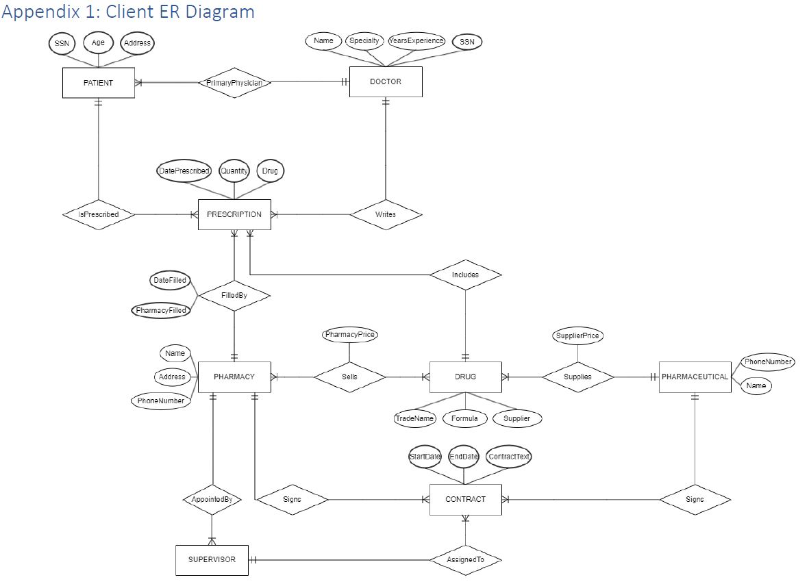
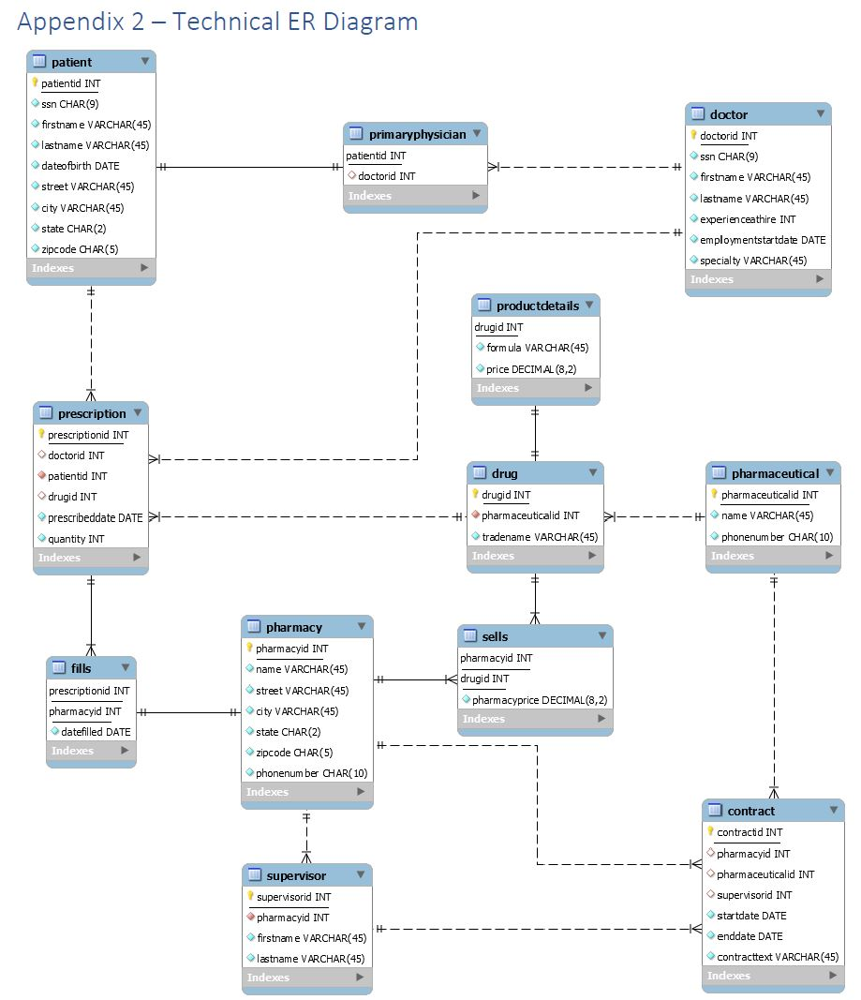
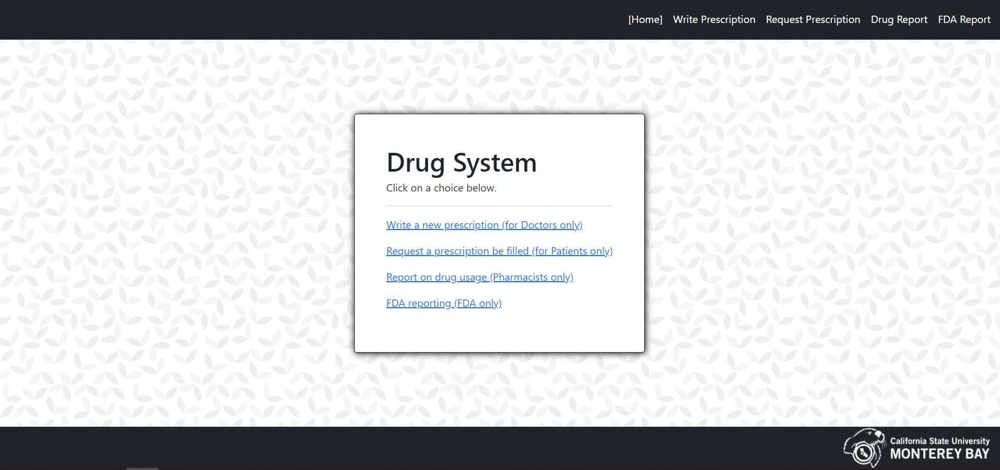
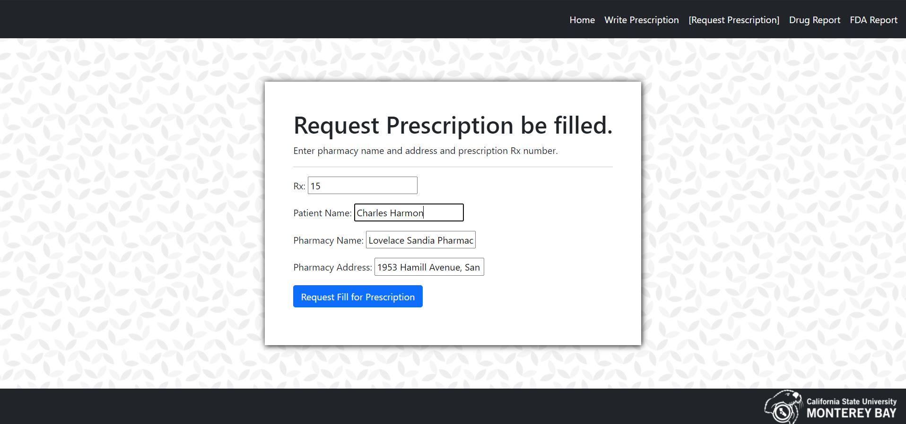
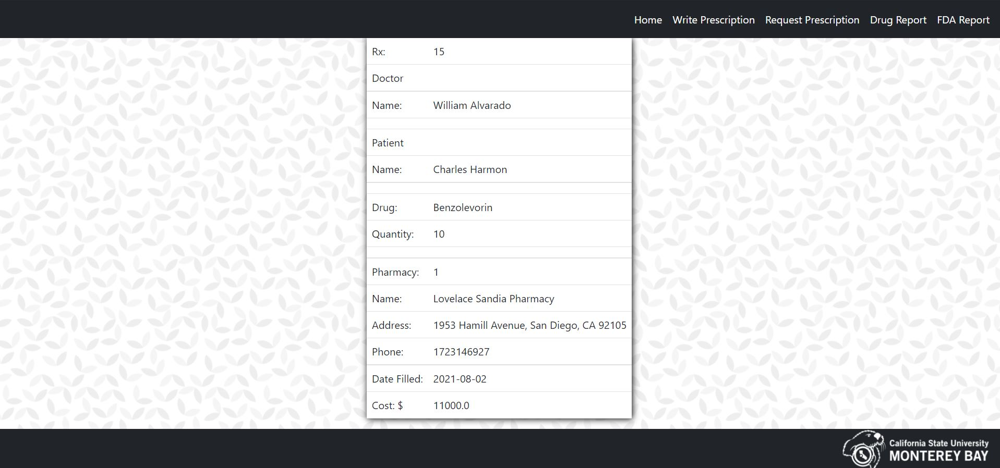

# CST 363 - Introduction to Database Systems

- Professor: David Wisneski

---

## Course Description

> This course provides balanced coverage of database use and design,focusing on relational databases. Students will learn to design relational schemas, write SQL queries, access a DB programmatically,and perform database administration. Students will gain a working knowledge of the algorithms and data structures used in query evaluation and transaction processing.

---

---

# Database Design and Implementation Project

The database for this project has been migrated to Heroku. The Spring Boot controller is hosted on Replit. However, it will take some time to start up on Replit (An error message will display until it does).

---

To run locally, you would need to perform the following:

1. Generate an application.properties file pointing to a local MySQL database in _/src/main/resources/_

2. Use the [MySQL Create Table Statements & Sample Data](./documentation/ShumStankovich_Project2_MySQL.sql) script to populate the database.

3. Enter the following command (bash) from the root directory of the project folder.

    <code>./mvnw spring-boot:run</code>

---

## Table of Contents

1. [Overview](#overview)
1. [Resources](#resources)
1. [ER Diagrams](#er-diagrams)
1. [Screen Shots](#screen-shots)

---

## Overview

> This repository contains my final project for CST 336: Intro to Database systems. This project occured in two phases:

### _Phase 1_

> Using MySQL, we designed and implemented a relational database containing 5 tables in 3NF. Our goal was to produce a system that a healthcare organization could use to track its patients, doctors, supplies, pharmaceuticals, pharmacies and contracts. As part of this project, we designed both a technical ER diagram (to be used for support and implementation) and a non-technical ER diagram (a simpler model to be consumed by a non-technical POC).

### _Phase 2_

> In this phase, we implented a simple web interface over our database, using Java and Thymeleaf in Spring Boot. After the project's completion, I applied additional styling (which is why diagrams will differ from front-end of the hosted link).

[Return to Top](#table-of-contents)

---

## Resources

- [Project Report and Spec Sheet](./documentation/ShumStankovich_Project2_Report.pdf)
- [MySQL Create Table Statements & Sample Data](./documentation/ShumStankovich_Project2_MySQL.sql)

> Please take a look at our project report for the full discussion on our design considerations and implementation, as well as screenshots and details concerning validation.

[Return to Top](#table-of-contents)

---

## ER Diagrams

[Return to Top](#table-of-contents)

---

## Screen Shots

[Return to Top](#table-of-contents)
